<div align="center">
    
        <h1>
            JellyHub
        </h1>
        <h3>The jellyfin servers media indexer</h3>
</div>
<br>

> [!IMPORTANT]
> This is Work In Progress.

<h2>About the project</h2>
JellyHub is a web app that allow you to fetch media from all of your jellyfin servers and regroup it in one place, so there is one place to search for specific media and tells you on wich server the desired media is located.

<br>
<h2>Installation</h2>

To be able to run JellyHub, first you must have **[Docker](https://www.docker.com/)** installed on your system.
<br>

Create a volume to store the data of the app or skip this step if you want to use a bind mount to a folder.

```sh
docker volume create jellyhub_data
```

Then you can run the app with the following command, make sure to replace the `AUTH_SECRET` and `SECRET_KEY` values with valid ones (You can generate a key for each with `openssl rand -base64 32`).

```sh
docker run -d --name jellyhub \
        -v jellyhub_data:/app/data \
        -e ALLOW_SIGNUP=false \
        -e AUTH_SECRET= \
        -e APP_URL=http://localhost:3000 \
        -e SECRET_KEY= \
        --restart unless-stopped \
        -p 3000:3000 \
        jellyhub
```

Now you can access the app at http://localhost:3000 _(adapt the host and port depending on how you configured it)_

<details>

<summary><h2>Screenshots</h2></summary>

Home Page
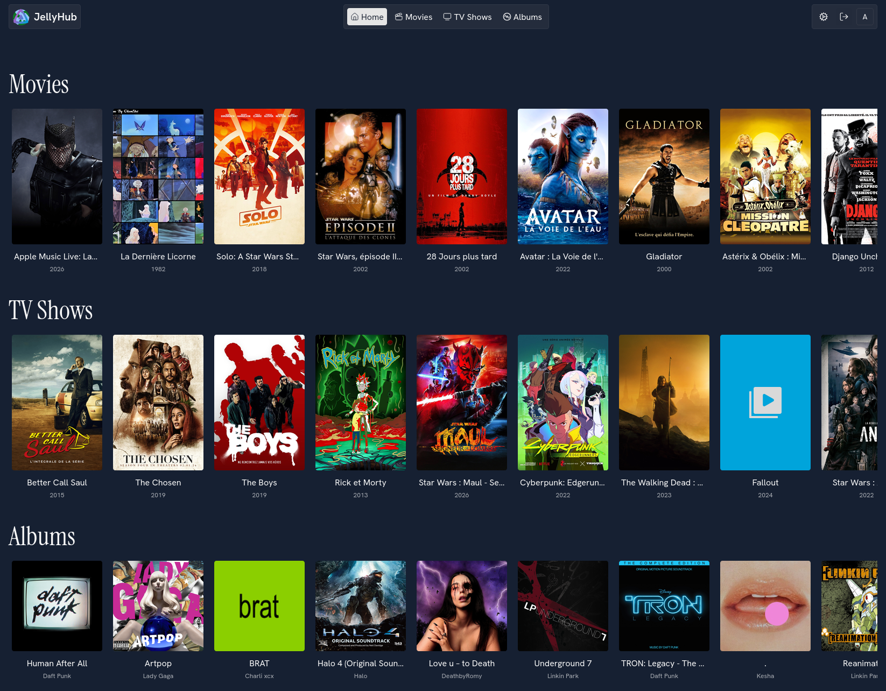

Movies Pages
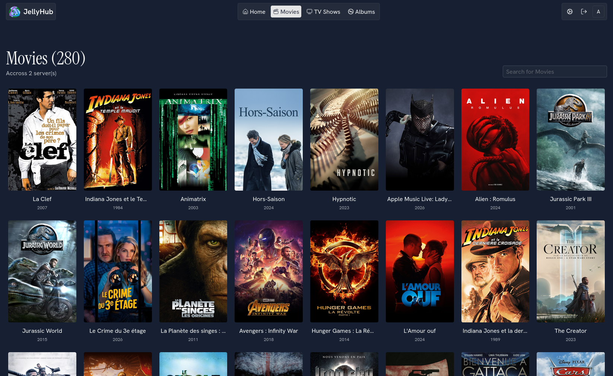

TV Shows Pages
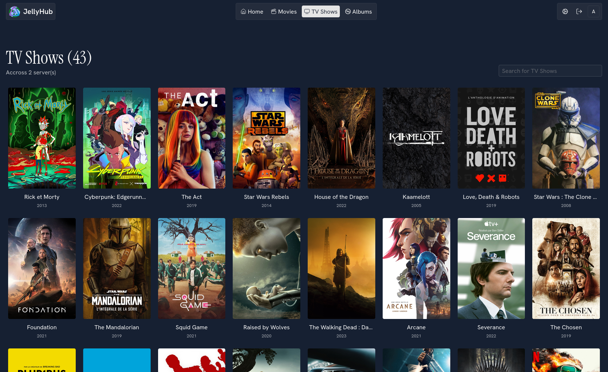

Albums Pages
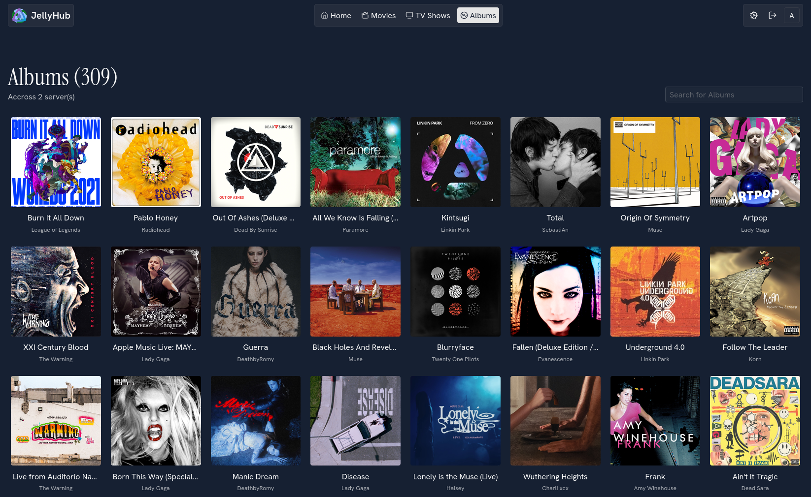

Movie Details Dialog
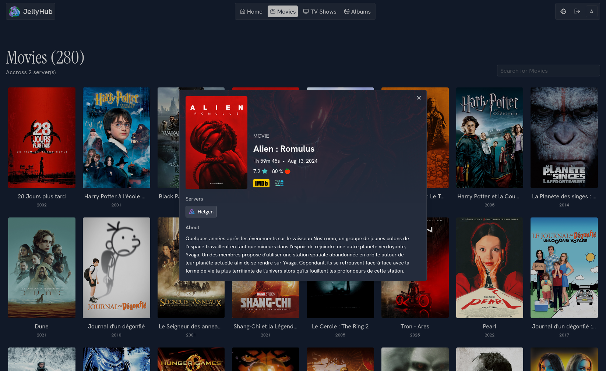

TV Show Details Dialog
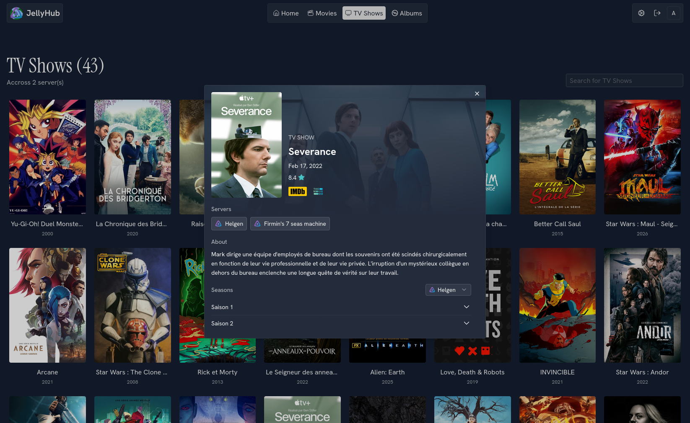

Album Details Dialog
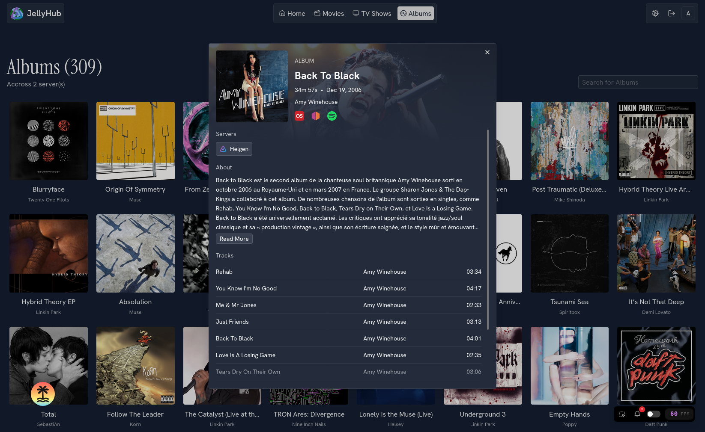

Servers List
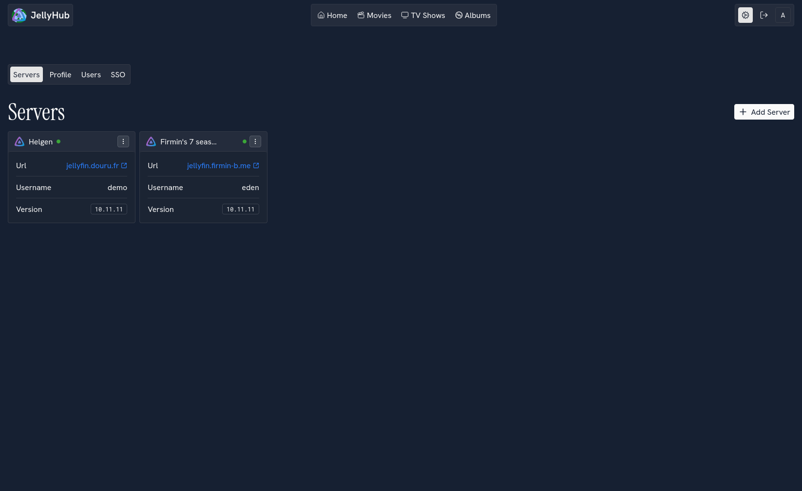

Users List
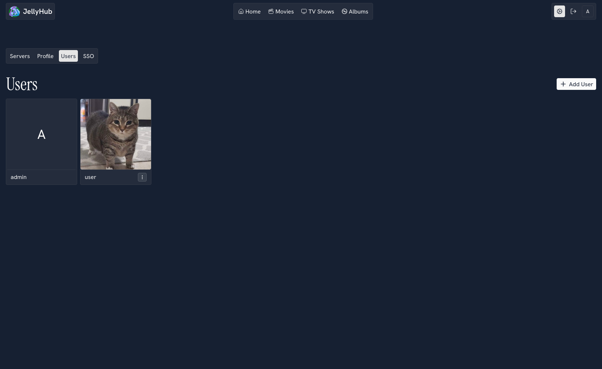

SSO List
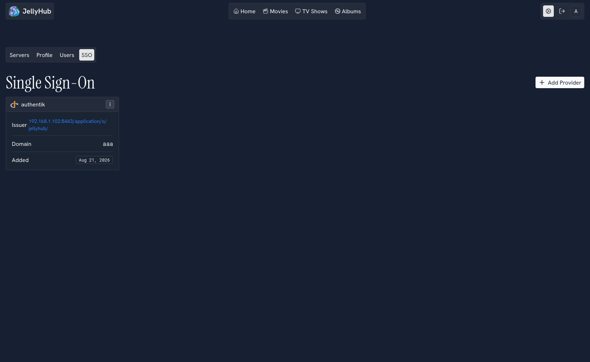

Login Page
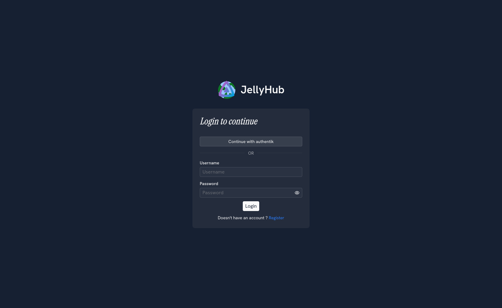

</details>
