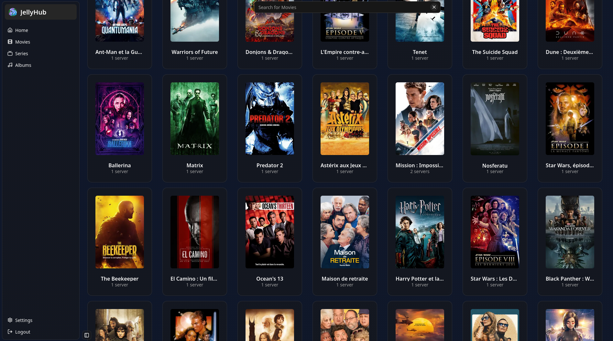

<div align="center">
    
        <h1>
            JellyHub
        </h1>
        <h3>The jellyfin servers media indexer</h3>
</div>
<br>

<h2>About the project</h2>
JellyHub is a web app that allow you to fetch media from all of your jellyfin servers and regroup it in one place, so there is one place to search for specific media and tells you on wich server the desired media is located.

<br>
<h2>Installation</h2>

To be able to run JellyHub, first you must have **[Docker](https://www.docker.com/)** installed on your system.
<br>

Copy the following command with your personallized environment variables to run the app.

```sh
docker run -d --name jellyhub \
    -v jellyhub_data:/app/data \ # either use a volume or a bind mount to make db persistent
    -e ALLOW_SIGNUP=true \
    -e BETTER_AUTH_SECRET=randomsecretstring \
    -e SECRET_KEY=64charhexstring \
    -e PORT=8888 \
    --restart unless-stopped \
    -p 8888:8888 \
    zigleur/jellyhub:latest
```

Now you can access the app at http://localhost:8888 _(adapt the host and port depending on how you configured it)_

The default user is `admin` with password `adminadmin`

<h2>Screenshots</h2>





<h2>Personal Note</h2>

Thanks to my friends [@firminunderscore](https://github.com/firminunderscore) [@0x4c756e61](https://github.com/0x4c756e61) and [@Zarox28](https://github.com/Zarox28) for allowing me to test the app on their jellyfin servers.
